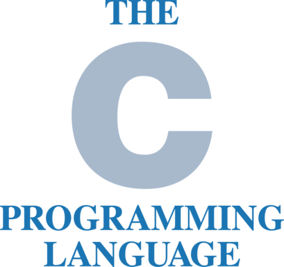

# The Scripting Language Tournament by [InfiniteCoder01](https://github.com/infiniteCoder01)
This is a merged tree of all of the solutions.
See releases for "Lost in files" master tarball

# Contestants
## OCaml

Submitted by: @nigelwithrow
Homepage: https://ocaml.org/
Tools Available: ocamlc (native compiler), ocaml (bytecode interpreter) , js_of_ocaml (javascript compiler), opam (package manager), dune (build system)

Why its the best scripting language:
The design of ocaml lends a lot of support for interactive & incremental programming, including:
Top-down evaluation
Static typing without explicit type annotation, most everything can be inferred
Type information visible in the REPL (both the bytecoder interpreter and the enhanced repl 'utop')

```ocaml
print_endline "Hello, World"
```

### Scoring
1. Portability - 7/10 (Runs _almost_ everywhere, can _technically_ be dynamically compiled and linked in runtime, but lacks on embedding otherwise (please, tell me if I'm wrong here). So no embedable JITs (although work is being done?)  or interpreters, which is crucial for part of scripting)
2. Ecosystem - 9/10 (Has a package manager (opam) & build system (dune), allows for bytecode and native, supports C interop. Also has a REPL (called top), has a bunch of packages. A little bit lacking in docs for packages, aforementioned lack of embedding tools)
3. Average development time - 8/10 (PLEASE, correct me, because I never used it. Because of ecosystem and tooling, it is fairly quick to start. Language looks pretty safe, static typing and things like optional type also help. Although I have no idea how functional and multi-paradigm aspect impacts this)


## Typescript

Submitted by: @grngxd
Solutions by: @nigelwithrow and @InfiniteCoder01
Homepage: https://typescriptlang.org/
Docs: https://www.typescriptlang.org/docs/
Toolset:node (nodejs runtime) npm (node package manager) npx (npm eXecute)
pnpm (performant npm [up to 2x faster]) pnpx (performant npm eXecute)
yarn alternative package manager for node

tsx typescript eXecute tsc typescript compiler

bun new blazingly fast runtime bunx bun eXecute

typescript is THE most diverse language, it itself can be compiled to native machine code (using https://porffor.dev/), compiles to human readable js, allows BUILT IN HTML templating, blazingly fast with the use of bun, static typing, everything can be inferred, typescript (npm) has a bigger package registry than pypi and ruby combined, then multiplied by 3, thesame language for frontend, backend, and scripting, with zero runtime cost as types dissapear after compilation, typescript can run anywhere from tiny microcontrollers to powering multi billion dollar businesses

```ts
console.log("Hello, World!")
```

### Scoring
1. Portability - 9/10 (Runs everywhere with node, can apparently be compiled, however often goes through JS. ~No way of embedding it into other languages though, which is crucial for part of scripting~ can actually be embedded with many JS engines)
2. Ecosystem - 9/10 (NPM... Have you heard of isEven package? Jokes aside, many package managers, ts-node gives you a REPL. Lacks a little in documentation. I'm not going to say anything on JS, because node does have native typescript support now)
3. Average development time - 9/10 (Typescript type system is very nice. Also has "hot reloading" and is just quick to get started with. The whole toolchain is pretty slow tho)


## BASH

Submitted by: @cgsdev0
Solutions by: @InfiniteCoder01
language: bash
homepage: https://www.gnu.org/software/bash/
manual: https://www.youtube.com/watch?v=7taNCDMpPvc

```bash
printf 'hello world\n'
```

### Scoring
1. Portability - 6/10 (Exists on literally ANY linux system. Requires other binaries, like coreutils and others to be usable, although can be used alone with enough extensions. Does not have a native interpreter, but just like C it is very old and widespread that people made some. Also, what's up with that?)
2. Ecosystem - 7/10 (Has Is a REPL, I guess. ~No package manager~ Package manager depends on your OS. Can use basically any CLI tool. Docs? Man pages!)
3. Average development time - 8/10 (You can start right away. You can also test separate functions pretty easily. But it has no safety features. And debugging can be a little bit annoying I guess, especially when the project gets large)


## The C programming language

Submitted by: @InfiniteCoder01
Homepage: https://www.c-language.org/
Tools Available: TCC, GCC, clang (and clangd), Emscripten, picoc and many others
This is an odd choice. But it shows that you can push the boundaries.
C is fast tho 🙂

```c
#include <stdio.h>

int main(int argc, char **argv) {
  printf("Hello, World!\n");
  return 0;
}
```

### Scoring
1. Portability - 6/10 (-1 for not having a native interpreter/repl/hot reloader, but it is such a simple and old language, that there are tools written for literally anything. It also is the first language to run on basically any hardware. -3 more for being platform-dependent, because cross-platform code becomes more complex than if you don't care about platform)
2. Ecosystem - 7/10 (well-known language, has A LOT of libraries, but it is missing an official implementation. Sure, most popular compilers are similar, but it is still a pretty big problem. It also has similar problems with package management)
3. Average development time - 5/10 (it is a very simple language, when writing it you probably won't have issues figuring out code architecture. And it has a lot of premade libraries. But lack of proper package manager/build system and a singular toolchain, together with inability to write cross-platform code easily and having segfaults and UB can make complex projects take a lot of extra time. If you use it a lot, you will get used to it and you will be able to cut devtime drastically, but for a scripting language, it is an issue)


## Ruby

Submitted by: @penguin-operator
Homepage: https://ruby-lang.org/
Docs: https://docs.ruby-lang.org/en/3.3/
Toolset: ruby (interpreter) , gem (packagemanager)

Short and elegant

```ruby
puts "hello world!"
```

### Scoring
1. Portability - 9.5/10 (Runs everywhere, embeds easily. Missing a native compiler, but it is not a big deal for a scripting language)
2. Ecosystem - 9/10 (Has a repl & package manager. Has a bunch of packages and docs are standard)
3. Average development time - 9/10 (Short and elegant indeed, however pretty old (legacy) and lacks a little bit of safety features)

Those are very high scores! 
